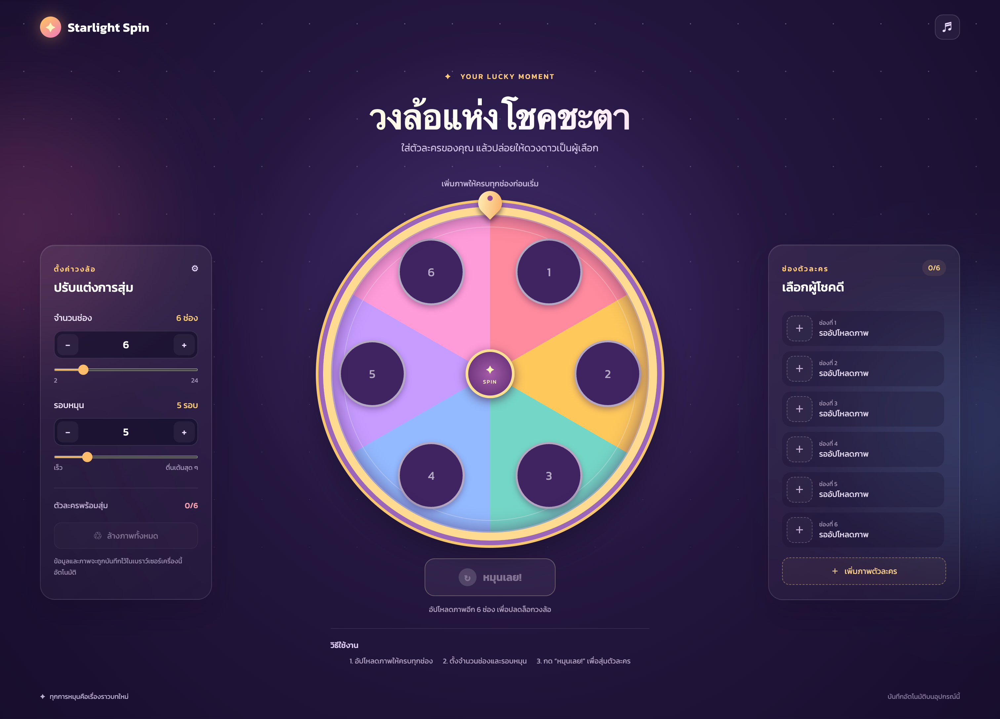

# Starlight Spin

วงล้อสุ่มตัวละครโทนแฟนตาซี สร้างด้วย HTML, CSS และ Vanilla JavaScript ไม่มี framework และไม่มี backend

## Demo

[เปิด Starlight Spin Demo](https://kongdech47.github.io/spin-wheel/)



## การใช้งาน

เปิด `index.html` ใน browser ได้โดยตรง หรือแนะนำให้ใช้ static server เพื่อให้การทำงานของ IndexedDB และการโหลด asset มีความสม่ำเสมอ:

```bash
python3 -m http.server 8000
```

จากนั้นเปิด [http://localhost:8000](http://localhost:8000)

## ความสามารถ

- กำหนดจำนวนช่องวงล้อ 2–24 ช่อง
- กำหนดรอบหมุน 1–20 รอบ
- อัปโหลดภาพ PNG, JPG หรือ WebP ขนาดไม่เกิน 8 MB ต่อภาพ
- เปลี่ยนและลบภาพรายช่อง
- สุ่มผู้ชนะพร้อม animation และเสียง
- บันทึกภาพและการตั้งค่าใน IndexedDB ของ browser เครื่องนั้น
- รองรับ desktop และ mobile

## โครงสร้างไฟล์

```text
index.html       โครงหน้าและ modal
app.js           logic วงล้อ, อัปโหลดภาพ และ IndexedDB
src/styles.css   สไตล์และ responsive layout
AGENTS.md        แนวทางสำหรับผู้ช่วย ผู้พัฒนา และกติกา commit message
```

หมายเหตุ: ข้อมูลใน IndexedDB จะไม่ถูกแชร์ข้าม browser, เครื่อง หรือ domain และการล้าง site data จะลบภาพที่บันทึกไว้
